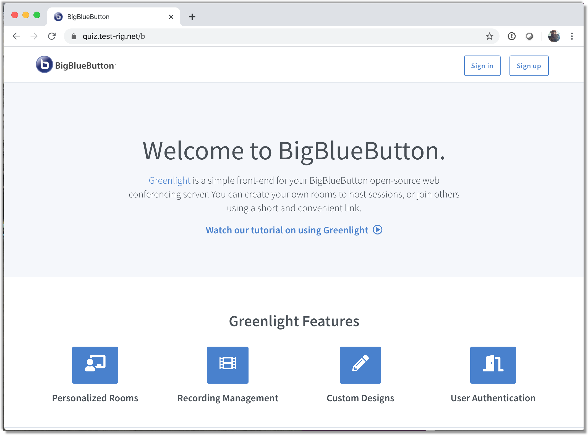
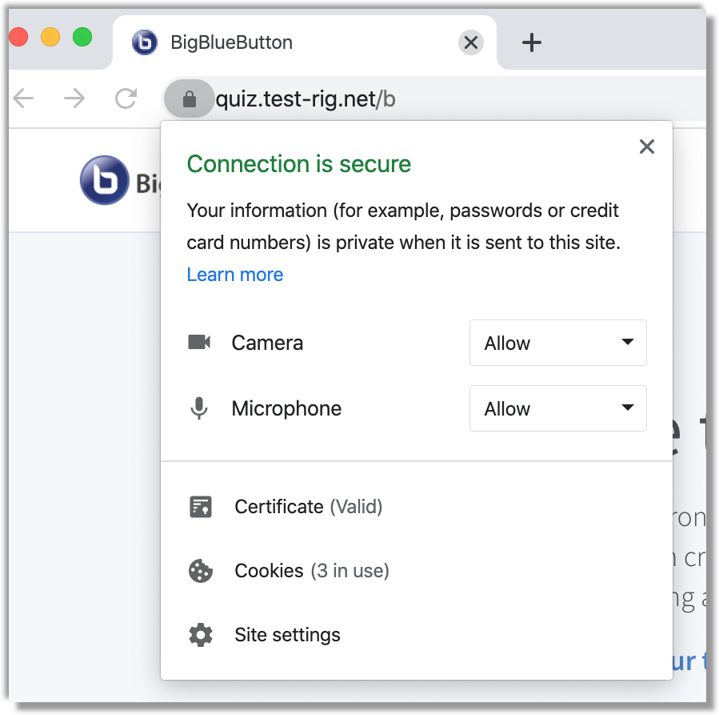
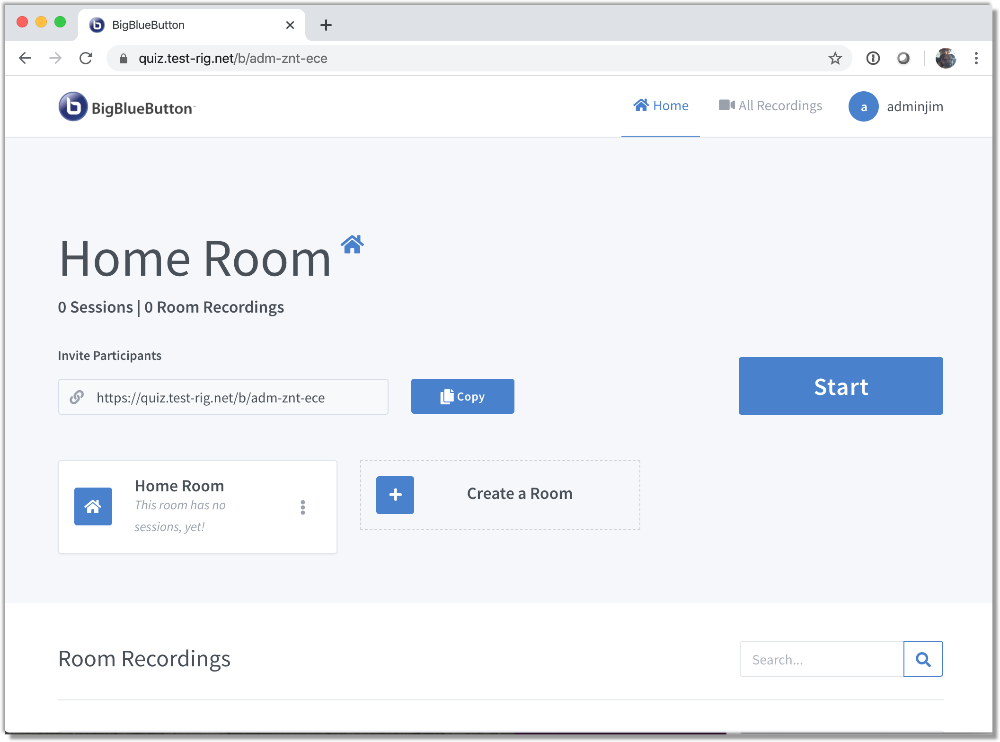
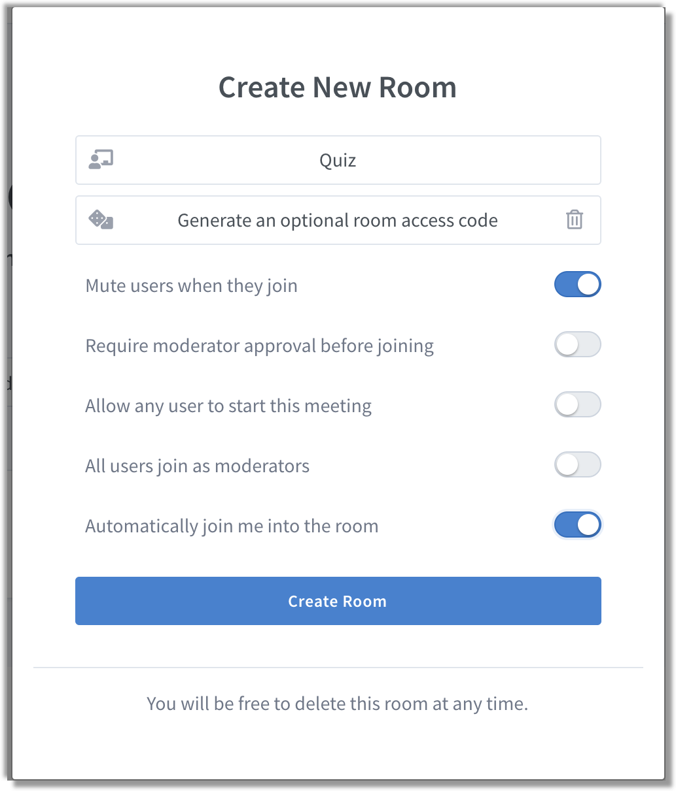
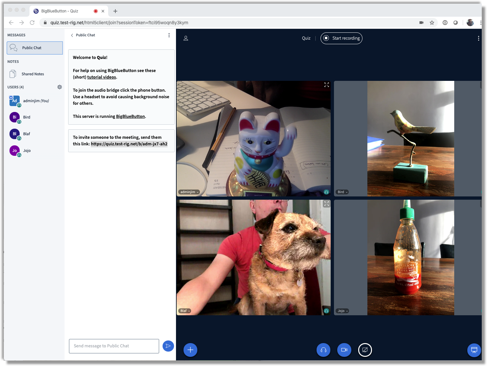

# BigBlueButton on packet.com 

*This page describes successsfully running and installing BigBlueButton web conferencing system on https://packet.com bare metal hosting.*


## Introduction


Who doesn't love a team quiz to get people together for a fun evening ? What with Corona lockdown here in The Netherlands I'd already run one online quiz for friends and family. 

Frustrated with the chaos of a Skype meeting and constantly asking people to "*...yes, please, press mute, otherwise no-one can hear the questions  .... no the MUTE button, top left .... oh they've gone ...*",  I was looking for a better Video Conferencing system without restrictions where I as quizmaster could easily present my questions but where everyone could still see each other.

It was then that my daughter suggested using BigBlueButton "*...it's what we are using for school lessons right now*..." 

I had a look on their [website](https://bigbluebutton.org/blog/) , and the specs were promising, HTML5, so no client software needed, works on laptops, tablets, smartphones, PDF slide presenting mode, mute-all possibility, it looked almost too good to be true. 

They also said that due to the high amount of memory bandwidth needed for mixing all those audio and video streams that they recommend ***not*** using a virtualised cloud host.

Hmmm... so who do we know that [provides on-demand baremetal cloud hosting and carrier grade networking ???](https://www.packet.com) 


## Installation

Here's how I did it.

The Instructions provided in the BigBlueButton docs are comprehensive and clear, but the following might make it even easier for you.

Installation should take no more that 40 minutes from start to finish, with a very few steps.

#### What You'll Need

- A packet.com account with your personal ssh public key uploaded
- A DNS service that you can manipulate. I use [DNSimple](https://dnsimple.com). 
- SSL Certificate - otherwise your browser will not allow the video and audio to be transmitted - the good news is that the install script automatically installs and uses [LetsEncrypt](https://letsencrypt.org/) free SSL certificates. Nice.


#### Packet Host

I logged into my packet account and chose a type **c2.medium.x86**. 

 

| Specs     |            |
| --------- | ---------- |
| CPU       | 24 core    |
| Memory    | 64GB       |
| Network   | 2 x 10Gbps |
| Disk Type | SSD        |


This is probably overkill for the number of (20) users I had, but it's not that much more expensive for a short time than a smaller specc'ed machine. For my testing I also saved some $$$ by using packet's [spot pricing](https://www.packet.com/developers/changelog/improved-deployment-spot-market-views/). The only OS that BigBlueButton supports is **Ubuntu 16.04**, so that's one less decision to make.


After a few minutes my server was ready and I could login via ssh.


```text
$ ssh root@40.30.20.10
Welcome to Ubuntu 16.04.5 LTS (GNU/Linux 4.4.0-134-generic x86_64)
..(snip)..
root@quiz:~#
```


#### DNS CNAME Record

Now that our server is running it's time to update your DNS. Update your A record to the IP of the newly created machine.N

```text
$ nslookup YOUR.HOST.NAME
Server:		62.179.104.196
Address:	62.179.104.196#53

Non-authoritative answer:
Name:	YOUR.HOST.NAME
Address: 40.30.20.10
```


Ok you are all set to run the  `bbb-install.sh`  script !


```
ssh root@YOUR.HOST.NAME
$ apt-get -y update
$ apt-get -y upgrade
$ wget https://ubuntu.bigbluebutton.org/bbb-install.sh 
$ bash bbb-install.sh -v xenial-220 -s YOUR.HOST.NAME -x -g -e YOUR@EMAIL.ADDRESS
```


The install script will run for about 10 minutes.

The script will also stop at some point and give you the ACME challenge for authorising your LetsEncrypt certificate. You need to then create a DNS TXT type record with the name given, LetsEncrypt then knows you are resposible for that domain and will issue a certificate. This certificate is then automatically installed by the `bbb-install.sh` script.


It looks a bit like this:

```
- - - - - - - - - - - - - - - - - - - - - - - - - - - - - - - - - - - - - - - -
Please deploy a DNS TXT record under the name
_acme-challenge.YOUR.HOST.NAME with the following value:

abcV4Ggn_blahblah5HaiFJ_w00tw00tbc87mOqbgZ-zx

Before continuing, verify the record is deployed.
- - - - - - - - - - - - - - - - - - - - - - - - - - - - - - - - - - - - - - - -
Press Enter to Continue
```


OK so now add this TXT record to your DNS zone. OK, done that ? Let's check in another terminal window:


```
nslookup -q=txt _acme-challenge.YOUR.HOST.NAME
Server:		62.179.104.196
Address:	62.179.104.196#53

Non-authoritative answer:
_acme-challenge.YOUR.HOST.NAME	text = "abcV4Ggn_blahblah5HaiFJ_w00tw00tbc87mOqbgZ-zx"
```

Now you can press ENTER to continue in the bbb-install window.

Last but not least, you will need to create an admin user. This is done by running a one-off docker command, like this:

```
$ docker exec greenlight-v2 bundle exec rake user:create["myadminuser","your@email.address","super-secret-password","admin"]
```


And in about a minute you will have your server running. Nice.

Now you can login and create a room !





Look, we are all SSL-secure. 





You can login with your newly created admin username and password..





Create a room for your next conference ...





All that's left is for you to invite your friends by sening the the URL and access code.





Looks like you are all set.


Any questions ? Suggestions ? Create an Issue or Pull Request on this github repo.


Thanks for watching !


Jim Leitch

April 2020