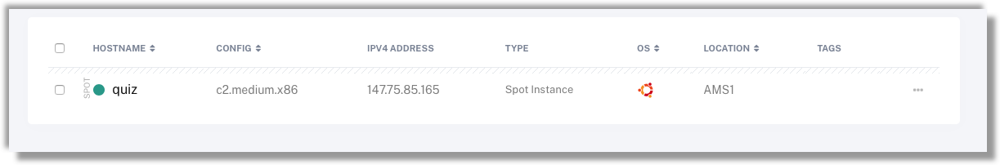

# BigBlueButton on packet.com 

*This page describes successsfully running and installing BigBlueButton web conferencing system on packet.com bare metal hosting.*


### Introduction


Who doesn't love a team quiz to get people together for a fun evening ? What with Corona lockdown here in The Netherlands I'd already run one online quiz for friends and family. 

Frustrated with the chaos of a Skype meeting and constantly asking people to "*...yes, please, press mute, otherwise no-one can hear the questions  .... no the MUTE button, top left .... oh they've gone ...*",  I was looking for a better Video Conferencing system without restrictions where I as quizmaster could easily present my questions but where everyone could still see each other.

It was then that my daughter suggested using BigBlueButton "*...it's what we are using for school lessons right now*" 

I had a look on their [website](https://bigbluebutton.org/blog/) , and the specs were promising, HTML5, so no client software needed, works on laptops, tablets, smartphones, slide presenting mode, mute-all possibility, it looked almost too good to be true. They also said that due to the high amount of memory bandwidth needed for mixing all those audio and video streams that they recommend ***not*** using a virtualised cloud host.

Hmmm... so who do we know that provides on-demand baremetal cloud hosting and carrier grade networking ??? https://www.packet.com


### Installation

Here's how I did it.

Installation should take no more that 40 minutes from start to finish, with very few steps

##### What You'll Need 

- packet.com account with your personal ssh public key uploaded
- A DNS service that you can manipulate


##### Packet Host

I logged into my packet account and chose a type **c2.medium.x86**. 

 

| Specs     |            |
| --------- | ---------- |
| CPU       | 24 core    |
| Memory    | 64GB       |
| Network   | 2 x 10Gbps |
| Disk Type | SSD        |


This is probably overkill for the number of (20) users I had, but it's not that much more expensive for a short time than a smaller specc'ed machine. For my testing I also saved some $$$ by using packet's [spot pricing](https://www.packet.com/developers/changelog/improved-deployment-spot-market-views/). 

The only OS that BigBlueButton supports is **Ubuntu 16.04**.


| -                                                            | -                                                       |
| ------------------------------------------------------------ | ------------------------------------------------------- |
| This is probably overkill for the number of (20) users I had, but it's not that much more expensive for a short time than a smaller specc'ed machine. For my testing I also saved some $$$ by using packet's [spot pricing](https://www.packet.com/developers/changelog/improved-deployment-spot-market-views/). |  |


After a few minutes my server was ready and I could login via ssh.




```bash
$ ssh root@147.75.85.165
Warning: Permanently added '147.75.85.165' (ECDSA) to the list of known hosts.
Welcome to Ubuntu 16.04.5 LTS (GNU/Linux 4.4.0-134-generic x86_64)
...
Ubuntu comes with ABSOLUTELY NO WARRANTY, to the extent permitted by
applicable law.

root@quiz:~#
```


